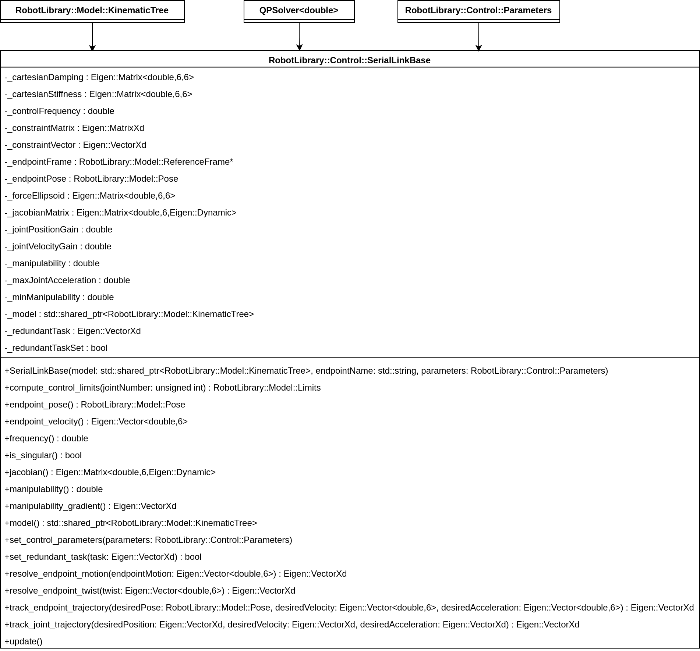

# :control_knobs: Control

[:back: Back to the Foyer](../README.md)

This sublibrary contains control classes for robots. At present, it contains the `SerialLinkBase` class, and the `SerialKinematicControl` class for real-time velocity control. A `SerialDynamicControl` class is in development.

:sparkles: Key Features:
- Joint feedback, and Cartesian feedback control.
- Seemeless integration with the [Trajectory](https://github.com/Woolfrey/software_robot_library/tree/master/Trajectory) sub-library.
- Optimisation using [Quadratic Programming (QP)](https://github.com/Woolfrey/software_simple_qp) to satisfy joint limits.
- Automatic redundancy resolution for singularity avoidance.

### :compass: Navigation:

- [Data Structures](#data-structures)
- [Serial Link Base](#serial-link-base)
- [Serial Kinematic Control](#serial-kinematic-control)
- [Release Notes](#package-release-notes---v100-april-2025)

## Data Structures

[:top: Back to Top](#control_knobs-control)

## Serial Link Base

This class provides a standardised structure to all serial link control classes, and polymorphism to implement different controllers for the same task.

> [!NOTE]
> `SerialLinkBase` inherits the `QPSolver` which can be used to optimise the Cartesian control. It is automatically downloaded by `RobotLibrary` from this [repository](https://github.com/Woolfrey/software_simple_qp).

### Construction:

1. A _pointer_ to a `KinematicTree` object,
2. The name of a valid reference frame (i.e. the endpoint of the robot) in said model for Carteisan control purposes, and
3. Optional control parameters (feedback gains, etc.).

This is done deliberately so that:
1. Two serial link controllers can control different endpoints on the same robot (e.g. a controller for each arm on a humanoid robot), and
2. The model can update the kinematics & dynamics independently in a separate thread.

### Key Methods:

> [!NOTE]
> These are virtual methods and must be defined in any derived class.

- `resolve_endpoint_motion` : Computes the joint control required to achieve a given motion (velocity or acceleration) of the endpoint.
- `resolve_endpoint_twist` : The same as above, but assumes the input is a twist (linear & angular velocity),
- `track_endpoint_trajectory` : Computes the joint control needed to follow a Cartesian trajectory.
- `track_joint_trajectory` : Computes the joint control needed to follow a joint trajectory.

### Class Diagram:

<p align="center">
  
</p>

[:top: Back to Top](#control_knobs-control)

### Serial Kinematic Control

This builds upon the `SerialLinkBase` class to implement algorithms for real-time velocity control.

> [!TIP]
> You can check out [my ROS2 action server](https:://github.com/Woolfrey/server_serial_link) to see this class in action.

### Construction:

The same as [`SerialLinkBase`](#construction).

### Key Methods:

The same as [`SerialLinkBase`](#key-methods).

- `track_joint_trajectory` computes:

  $\dot{\mathbf{q}} = \dot{\mathbf{q}}_d + k_p\left(\mathbf{q}_d - \mathbf{q} \right)$
  where:
  - $\dot{\mathbf{q}}\in\mathbb{R}^n$ are the joint velocities to command the robot,
  - $\mathbf{q}_d,\dot{\mathbf{q}}_d\in\mathbb{R}^n$ is the desired joint position and joint velocity,
  - $\mathbf{q}\in\mathbb{R}^n$ is the current joint position, and
  - $k_p\in\mathbb{R}^+$ is the joint position gain.


### Cartesian Velocity Control

The method:
```
Eigen::VectorXd
track_cartesian_trajectory(const RobotLibrary::Model::Pose &desiredPose,
                           const Eigen::Vector<double,6> &desiredVelocity,
                           const Eigen::Vector<double,6> &desiredAcceleration);
```
computes:
```math
\dot{\mathbf{x}} = \dot{\mathbf{x}}_d + \mathbf{K}\left(\mathbf{x}_d - \mathbf{x}\right)
```
where:
- $\mathbf{x}\in\mathbb{R}^6$ is the command twist (Cartesian velocity) for the endpoint of the robot,
- $\mathbf{x}_d,\dot{\mathbf{x}}_d$ is the desired pose & twist,
- $\mathbf{x}\in\mathbb{SE}(3)$ is the current pose of the endpoint, and
- $\mathbf{K}\in\mathbb{R}^{6\times 6}$ is the Cartesian stiffness matrix.

It then immediately calls:
```
Eigen::VectorXd
resolve_endpoint_motion(const Eigen::Vector<double,6> &endpointMotion)
```
which solves a different problem depending on if the robot is redundant or not.

For a non-redundant robot the problem is:
```math
\begin{align}
  \min_\dot{\mathbf{q}} \frac{1}{2}\|\dot{\mathbf{x}} - \mathbf{J}\dot{\mathbf{q}} \|^2 \\
  \text{subject to: } \dot{\mathbf{q}}_{min} \le \dot{\mathbf{q}} \le \dot{\mathbf{q}}_{max} \\
                      \dot{\mu} \ge \gamma \left(\mu - \mu_{min}\right)
\end{align}
```
where:
- $\mathbf{J}\in\mathbb{R}^{6\times n}$ is the Jacobian matrix,
- $\dot{\mathbf{q}}min$ and $\dot{\mathbf{q}}_{max}\in\mathbb{R}^n$ are lower and upper bounds on the joint speed based on joint limits (both position and speed),
- $\mu$ is the measure of manipulability (proximity to a singularity), and
- $\mu_{min}$ is the minimum manipulability threshold.

If the robot is redundant it solves,
```math
\begin{align}
  \min_\dot{\mathbf{q}} \frac{1}{2}\|\dot{\mathbf{q}}_{\varnothing} - \dot{\mathbf{q}} \|_M^2 \\
  \text{subject to: } \dot{\mathbf{x}} = \mathbf{J}\dot{\mathbf{q}} \\
               \dot{\mathbf{q}}_{min} \le \dot{\mathbf{q}} \le \dot{\mathbf{q}}_{max} \\
                      \dot{\mu} \ge -\gamma \left(\mu - \mu_{min}\right)
\end{align}
```
where:
- $\dot{\mathbf{q}}_{\varnothing}\in\mathbb{R}^n$ is a redundant task, and
- the solution is weighted by the inertia matrix $\mathbf{M}(\mathbf{q})\in\mathbb{R}^{n\times n}$.

> [!TIP]
> You can set the redundant task with the `set_redundant_task()` method. If none is provided, it automatically uses the gradient projection method to move away from singularities (where possible).

> [!NOTE]
> If the singularity avoidance fails and the manipulability $\mu$ is below $\mu_{min}$, then the algorithm automatically reverts to a damped-least-squares method to avoid numerical instability.

## :package: Release Notes - v1.0.0 (April 2025)

Tested and implemented:
- `SerialLinkBase`
- `SerialKinematicControl`

