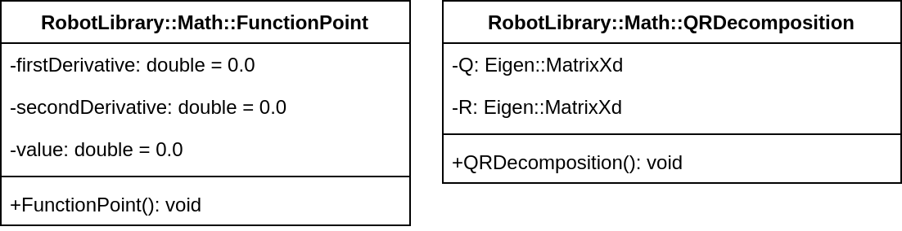

# :abacus: Math

[:back: Back to the Foyer](../README.md)

This sub-library contains useful functions and classes to support the other sub-libraries.

:sparkles: Key Features:
- Automatically downloads [this quadratic programming algorithm](https://github.com/Woolfrey/software_simple_qp) which is inherited by the `Control::SerialLinkBase` class.
- Generate polynomials of any order.
- Generate cubic splines for smooth interpolation over any number of waypoints.

> [!NOTE]
> There are many functions specified in the `MathFunctions.h` header file that are not expounded upon here, but you can always read the code and make use of them at your own behest.

### :compass: Navigation:
- [Data Structures](#data-structures)
- [Polynomial](#polynomial)
- [Spline](#spline)

## Data Structures:

<p align="center">
	
</p>

[:top: Back to Top](#abacus-math)

## Polynomial

This class defined a function of the form:

```math
y = f(x) = c_{0} \cdot x^0 + c_1 \cdot x^1 + c_2 \cdot x^2 + \dots + c_n \cdot x^n.
```

### Construction:

1. A `FunctionPoint` defining $y$, $y'$, and $y''$ for the start point of the polynomial $x_0$,
2. A `FunctionPoint` defining $y$, $y'$, and $y''$ for the end point of the polynomial $X_f$,
3. The start point $x_0$,
4. The final point $x_f$, and
5. The order of the polynomial $n$.

### Key Methods:

The method `evaluate_point` will return the value $y(x)$ for the given $x$.

> [!NOTE]
> It is possible to query the polynomial for a value outside the range of $x_0 - x_f$, so that's on you :index_pointing_at_the_viewer:.

### Class Diagram:

<p align="center">
	
</p>

[:top: Back to Top](#abacus-math)

## Spline

This class interpolates a series of points with piece-wise `Polynomial`s connecting them. For any two points $(x_i, y_i)$ and $(x_{i+1}, y_{i+1})$, we can fit a polynomial between them:

```math
p_i(x) = c_0 \cdot x^0 + c_1 \cdot x_1^2 + c_2 \cdot x^2 + \dots + c_n \cdot x^n
```

such that:

```math
p_i (x_i) = y_i, \text{ and } p_i(x_{i+1}) = y_{i+1}
```

> [!TIP]
> You can use the `solve_cubic_spline_derivatives` method in `MathFunctions.h` to ensure continuity of 1st and 2nd derivatives across the support points.

### Construction:

1. An array of `FunctionPoint` values $y_1, \dots, y_m$,
2. The matching point $x_i$ for each $y_i$, and
3. The polynomial order.

> [!NOTE]
> The polynomial order must be an _odd_ number, since 2 points requires a _minimum_ $p = c_0\cdot x^0 + c_1\cdot x^1$, and to fit the 2 first derivatives requires $p = c_0\cdot x^0 + c_1\cdot x^1 + c_2\cdot x^2 + c_3\cdot x^3$, etc.

### Key Methods:

The `evaluate_point` method returns the interpolated value $y = f(x)$ for the given point $x$.

### Class Diagram:

<p align="center">
	
</p>

[:top: Back to Top](#abacus-math)
