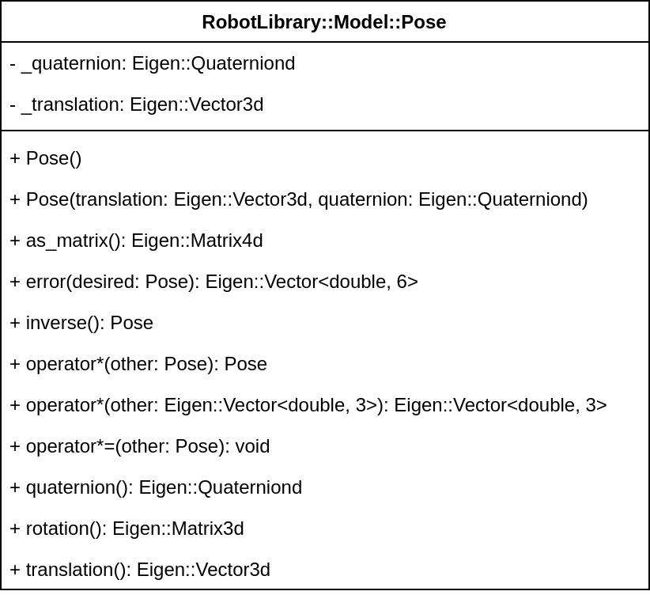
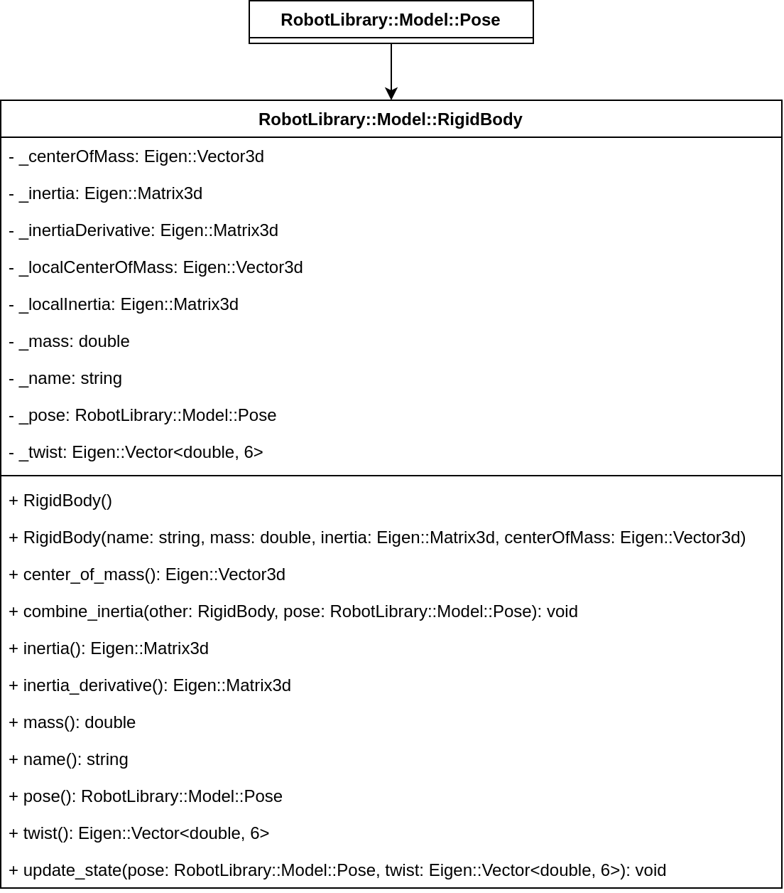
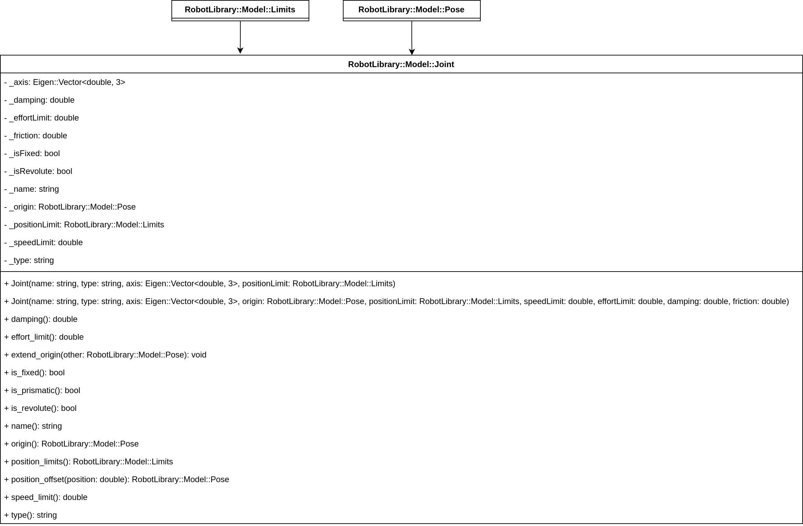
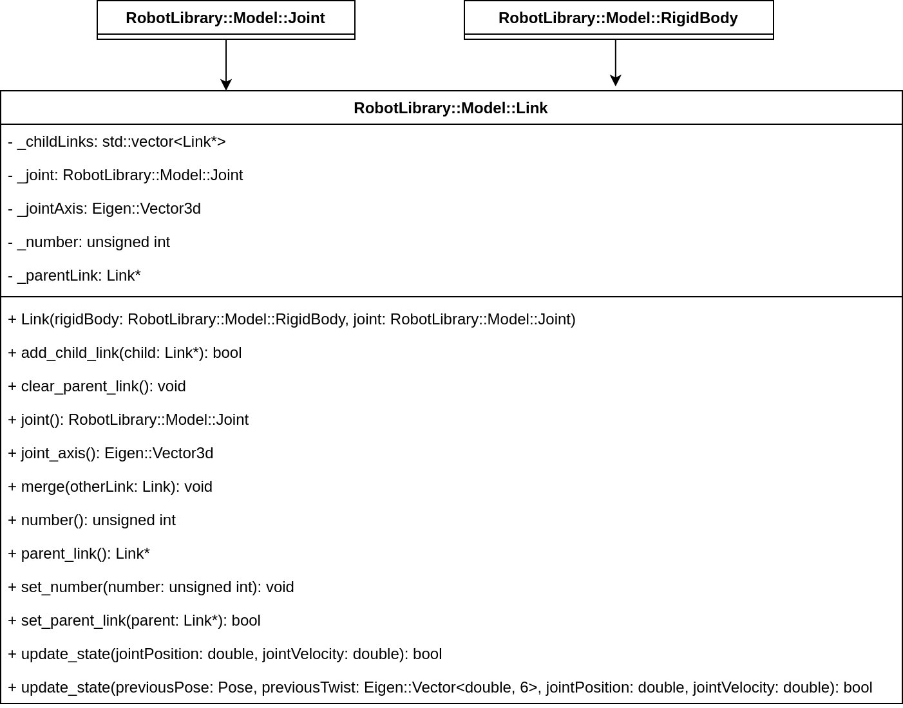
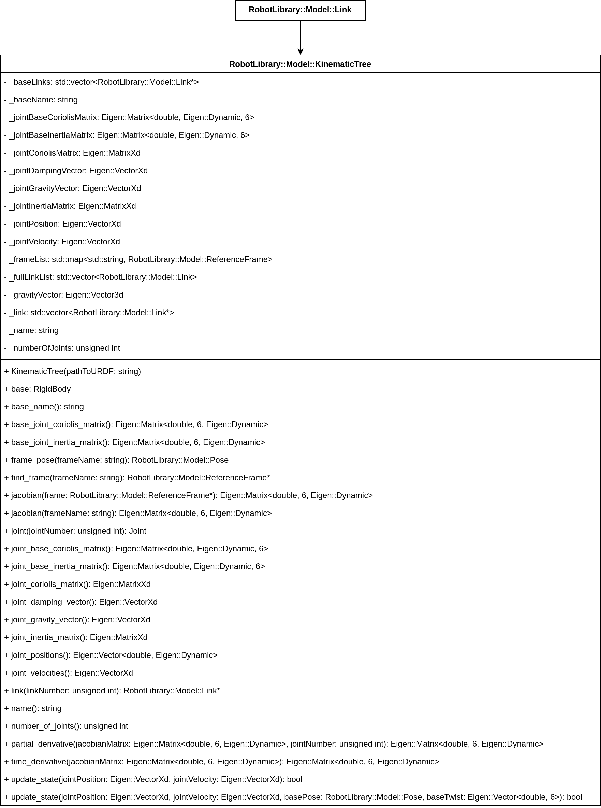

# :building_construction: Model
[:back: Back to the Foyer](../README.md)

This sub-library enables physical modeling of serial-link robot structures to compute kinematics & dynamics.

:sparkles: Key Features:
- Full forward kinematics & inverse dynamics of branching, rigid-body structures.
- Able to compute Jacobians to any point on a structure, and evaluate its partial & time derivatives.
- Able to compute the inverse dynamics of floating-base structures.

### :compass: Navigation

- [Data Structures](#data-structures)
- [Pose](#pose)
- [Rigid Body](#rigid-body)
- [Joint](#joint)
- [Link](#link)
- [Kinematic Tree](#kinematic-tree)

## Data Structures

<p align="center">
     
</p>

[:top: Back to Top](#building_construction-model)

## Pose

This class represents position & orientation in 3D space (i.e. the Special Euclidean group $\mathbb{SE}(3)$). Whilst the `Eigen::Isometry3d` class uses a 4x4 matrix $\mathbb{R}^{4\times 4}$, the `RobotLibrary::Model::Pose` class combines an `Eigen::Vector3d` object for translation, and an `Eigen::Quateriond` for orientation. This is in line with [transforms in ROS2](https://docs.ros2.org/foxy/api/geometry_msgs/msg/Transform.html).

### Construction:

1. An `Eigen::Vector3d` object for the position/translation, and
2. An `Eigen::Quaterniond` object for the orientation/rotation.

### Key Methods:

- `operator* (const Pose &other)`: Multiply two poses together,
- `operator* (const Eigen::Vector<double,3> &other)`: Rotate a vector,
- `as_matrix`: Convert the object to an `Eigen::Matrix<double,4,4>` object.
- `error`: Compute the position & orientation error between this pose, and another (useful for feedback control!)

### Class Diagram:

<p align="center">
     
</p>


[:top: Back to Top](#building_construction-model)

## Rigid Body

This represents a single, solid (physical) object in 3D space. It can be used to compute the dynamic forces as it moves:

```math
     \begin{align}
          \mathbf{f} &= m\dot{\mathbf{v}} \\
          \mathbf{m} &= \mathbf{I}\boldsymbol{\omega} + \dot{\mathbf{I}}\boldsymbol{\omega}
     \end{align}
```
where:
- $\mathbf{f}\in\mathbb{R}^3$ are the linear forces (N),
- $\mathbf{m}\in\mathbb{R}^3$ are the moments (Nm),
- $m\in\mathbb{R}^+$ is the mass (kg),
- $\mathbf{I}, \dot{\mathbf{I}}\in\mathbb{R}^{3\times 3}$ is the inertia matrix (kg*m^2), and its derivative
- $\mathbf{v},\dot{\mathbf{v}}\in\mathbb{R}^3$ is its linear velocity (m/s) & acceleration (m/s/s), and
- $\boldsymbol{\omega}, \dot{\boldsymbol{\omega}}$ is its angular velocity (rad/s) & acceleration (rad/s/s).

### Construction:

1. A name (as a unique identifier),
2. Its mass,
3. Its inertia matrix (in its origin coordinate frame)
4. The location of its center of mass relative to its origin coordinate frame.

### Key Methods:

- `update_state` : Updates $\mathbf{I},\dot{\mathbf{I}}$.
- `mass` gets the mass (duh!),
- `inertia` gets the inertia $\mathbf{I}$ in the _global_ reference frame,
- `inertia_derivative` get $\dot{\mathbf{I}}$ in the _global_ reference frame,
- `combine_inertia` lets you merge two masses together.

### Class Diagram:

<p align="center">
     
</p>

[:top: Back to Top](#building_construction-model)

## Joint

Represents an actuated joint on a robot. It can be used for modeling, but also for control, since it provides details on position & velocity limits.

### Construction:

1. Its name (a unique identifier),
2. Its type (revolute or prismatic),
3. Its (local) axis of rotation,
4. Its origin relative to the _previous_ link or body in a kinematic chain,
5. Its position, speed, and effort (torque) limits,
6. Its damping & friction properties.

### Key Methods:

Honestly, it's not that interesting or useful outside the `Link` class. You can always read that if you like.

### Class Diagram:

<p align="center">
     
</p>

[:top: Back to Top](#building_construction-model)

## Link

This class combines a `RigidBody` with a `Joint` to compute the kinematic & dynamic contributions of the link of a robot to its overall structure.

### Construction:

1. A `RigidBody`, and
2. A `Joint` object.

### Key Methods:

- `update_state` updates the kinematics & dynamics of the `RigidBody` given its new pose and velocity.
- `parent_link` returns a point to the _previous_ link in a kinematic chain so it can be traversed backwards,
- `child_links` gives an array of links proceeding this one in a kinematic chain,
- `merge` can combine the kinematic & dynamic properties of links connected by a fixed joint, to eliminate the latter from the model.

### Class Diagram:

<p align="center">
     
</p>

[:top: Back to Top](#building_construction-model)

## Kinematic Tree

This is the core of the model sub-library. It represents a branching structure of serial, rigid bodies connected by actuated joints. It has 2 important features:

1. Computing the forward kinematics (of a branch):

```math
\mathbf{x} = \mathbf{k}(\mathbf{q})
```
where $\mathbf{x}\in\mathbb{SE}(3)$ is the pose of a point on the branch, and $\mathbf{q}\in\mathbb{R}^n$ are the joint positions, and

2. Computing the inverse dynamics (of the whole structure):

```math
\boldsymbol{\tau} = \mathbf{M}(\mathbf{q})\ddot{\mathbf{q}} + \mathbf{C}(\mathbf{q},\dot{\mathbf{q}})\dot{\mathbf{q}} + \mathbf{g}(\mathbf{q}) + \mathbf{d}(\dot{\mathbf{q}})
```
where:
- $\boldsymbol{\tau}\in\mathbb{R}^n$ is the joint torque (that you compute),
- $\mathbf{M}(\mathbf{q})\in\mathbb{R}^{n\times n}$ is the inertia matrix,
- $\mathbf{C}(\mathbf{q},\dot{\mathbf{q}})\in\mathbb{R}^{n\times n}$ is the Coriolis matrix,
- $\mathbf{g}(\mathbf{q})\in\mathbb{R}^n$ is the gravitational torque vector, and
- $\mathbf{d}(\dot{\mathbf{q}})\in\mathbb{R}^n$ is the torque vector from viscous friction.

### Construction:

A [URDF file](https://docs.ros.org/en/jazzy/Tutorials/Intermediate/URDF/Building-a-Visual-Robot-Model-with-URDF-from-Scratch.html). That's it! :sunglasses:

### Key Methods:

- `update_state` computes the forward kinematics & inverse dynamics for a given joint state (positions & velocities).
- `joint_inertia_matrix` gives $\mathbf{M}$,
- `joint_coriolis_matrix` gives $\mathbf{C}$,
- `joint_gravity_vector` gives $\mathbf{g}$,
- `joint_damping_vector` gives $\mathbf{d}$,
- `jacobian` gives $\mathbf{J} = \partial\mathbf{f}/\partial\mathbf{q}$,
- `partial_derivative` gives $\partial\mathbf{J}/\partial q_i$ for a given joint number $i$, and
- `time_derivative` gives $d\mathbf{J}/dt$.

> [!NOTE]
> There are also methods for computing the dynamic coupling with the _base_ of the robot as well (useful for floating base systems).

### Class Diagram:

<p align="center">
     
</p>

[:top: Back to Top](#building_construction-model)
