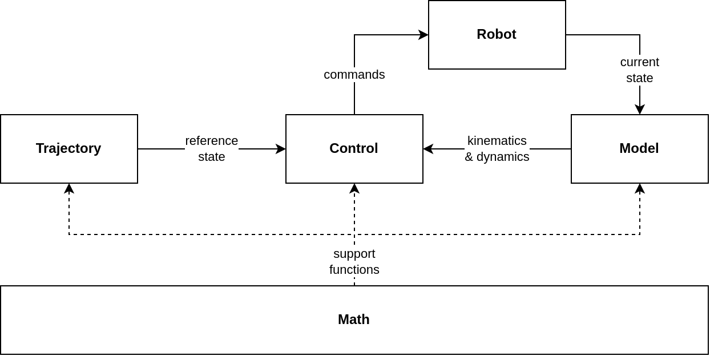

# :robot: Robot Library :open_book:

Robot Library is a C++ package for modeling, trajectory generation, and control of robots. The [initial release](#package-release-notes---v100-april-2025) supports real-time velocity control of serial link robot arms (work on torque control is underway!). Checkout the [ROS2 action server](https://github.com/Woolfrey/server_serial_link) to see it in action :boom:

#### :sparkles: Features:
- _Everything_ is contained in _one_ library: modeling, control, _and_ trajectory generation.
- Easy-to-use control classes with automatic joint limit avoidance, redundancy resolution, singularity avoidance, etc.
- Modular design:
   - Build your own controllers from `SerialLinkBase` class, or make one entirely from scratch with the `KinematicTree` class.
   - Use the trajectory generation classes for your controller. Or don't - make your own!
- Full inverse dynamics for floating-base robots with the `KinematicTree` class.
- All you need is a [URDF](https://docs.ros.org/en/jazzy/Tutorials/Intermediate/URDF/URDF-Main.html) to get started :sunglasses:

#### :compass: Navigation:

- [Sections of the Library](#classical_building-sections-of-the-library)
- [Installation](#floppy_disk-installation)
    - [Requirements](#requirements)
    - [Installing Eigen](#installing-eigen)
    - [Installing RobotLibrary](#installing-robotlibrary)
- [Using Robot Library](#rocket-using-robot-library)
    - [In Another Project](#in-another-project)
    - [Examples](#examples)
- [Release Notes](#package-release-notes---v100-april-2025)
- [Contributing](#handshake-contributing)
- [Citing this Repository](#bookmark_tabs-citing-this-repository)
- [License](#scroll-license)

## :classical_building: Sections of the Library

- [Control](Control/README.md): Classes for real-time, feedback control.
- [Math](Math/README.md): Supporting functions & classes for other parts of the library.
- [Model](Model/README.md): Classes for computing the kinematics & dynamics of rigid-body structures.
- [Trajectory](Trajectory/README.md): Classes for generating paths through space & time.

The diagram below shows how the different libraries interact:

<p align="center">
    
</p>

[:top: Back to Top.](#robot-robot-library-open_book)

## :floppy_disk: Installation

### Requirements:

- CMake 3.14 or higher
- C++17 or higher 
- Eigen3 v3.4 or higher

### Installing Eigen:

> [!NOTE]
> You need to manually install Eigen 3.4 if you're using Ubuntu 20.04.

#### Ubuntu 20.04

1. First ensure prerequisites are installed:

    `sudo apt update`
    
    `sudo apt install -y build-essential cmake git`
    
2. Download version 3.4 directly (or from the webpage):

    `wget https://gitlab.com/libeigen/eigen/-/archive/3.4.0/eigen-3.4.0.tar.gz`

3. Extract the downloaded file:

    `tar -xvf eigen-3.4.0.tar.gz`
    
    `cd eigen-3.4.0`
    
4. Build and install:

    `mkdir build && cd build`
    
    `cmake ../`
    
    `sudo make install`

#### Ubuntu 22.04 & Later

Eigen 3.4 is automatically installed on later versions of Ubuntu. In the command line you can run:

  `sudo apt install libeigen3-dev`

### Installing RobotLibrary:

1. Clone this repository in to your working directory:

   `git clone https://github.com/Woolfrey/software_robot_library.git`
   
2. Navigate in to the folder:

   `cd ~/<your_working_directory>/software_robot_library`

3. Create a build directory and navigate in to it:

   `mkdir build && cd build`

4. Run the following commands in the `build` directory:

   `cmake ..`
   
   `sudo make install`

You should now be able to include different parts of the library in your C++ files.

[:top: Back to Top.](#robot-robot-library-open_book)

## :rocket: Using Robot Library

### In Another Project:

When using `RobotLibrary` classes in another project, it is necessary to link both `Eigen` and `RobotLibrary` when compiling executables. For example, we may want to use the `KinematicTree` class in the `example.cpp` of the following example project:

```
example_project/
├── build/
├── src/
|   └── example.cpp
└── CMakeLists.txt
```

In the `example.cpp` file we can include the `KinematicTree` header file under `RobotLibrary`:

```
#include <RobotLibrary/Model/KinematicTree.h>
...
int main(int argc, char **argv)
{
     RobotLibrary::Model::KinematicTree model("path/to/robot.urdf");
}
```

Then, in the `CMakeLists.txt` file, we must:
1. Tell the compiler to find both `Eigen3` and `RobotLibrary`, and
2. Link `RobotLibrary` and `Eigen3` to the executable that uses any `RobotLibrary` classes:

```
cmake_minimum_required(VERSION 3.8)
project(example)
...
find_package(Eigen3 REQUIRED)
find_package(RobotLibrary REQUIRED)

include_directories(${EIGEN3_INCLUDE_DIR}) 
...
add_executable(example src/example.cpp)
target_link_libraries(example RobotLibrary::RobotLibrary Eigen3::Eigen)
```

Inside the `example_project/build` folder it should  be possible to compile the project:

```
cmake ..
make
```

### Examples:

If you would like to see examples where `RobotLibrary` has been applied, you can check out:

- [Serial Link Action Server](https://github.com/Woolfrey/server_serial_link) : My own ROS2 action servers for control,
- [Kuka iiwa14 velocity control](https://github.com/Woolfrey/control_kuka_velocity) : a ROS2 package which implements the former action server, and
- [TestingRobotLibrary](https://github.com/Woolfrey/testing_robot_library) : C++ executables I use for numerical validation of RobotLibrary.

[:top: Back to Top.](#robot-robot-library-open_book)

## :package: Release Notes - v1.0.0 (April 2025)

### :tada: Initial Release:
- Control:
     - SerialLinkBase : Base class providing common structure for all child classes.
     - SerialKinematicControl : Joint velocity & Cartesian velocity control algorithms.
- Math:
     - MathFunctions : Helper functions for other classes.
     - Polynomial : Generates a scalar, polynomial function.
     - SkewSymmetric: Converted an `Eigen::Vector3d` object to an anti-symmetric `Eigen::Matrix3d` object.
     - Spline : Connects multiple points using polynomials, whilst ensuring continuity.
- Model:
     - Joint : Models an actuated joint on a robot.
     - KinematicTree : Kinematic & dynamic modeling of branching, serial-link structures.
     - Link : Represents a combined `Joint` and `RigidBody` object.
     - Pose : Position and orientation; $\mathbb{SE}(3)$.
     - RigidBody : Dynamics for a single, solid object.
- Trajectory:
     - CartesianSpline : Generates smooth trajectories over a series of poses.
     - SplineTrajectory : Generates smooth trajectories over a series of points.
     - TrajectoryBase : Provides common structure to all trajectory classes.
     - TrapezoidalVelocity : Trajectory with constant sections, and ramps up and down.
  
[:top: Back to Top.](#robot-robot-library-open_book)
    
## :handshake: Contributing

Contributions to this repositore are welcome! Feel free to:
1. Fork the repository,
2. Implement your changes / improvements, then
3. Issue a pull request.

If you're looking for ideas, you can always check the [Issues tab](https://github.com/Woolfrey/software_robot_library/issues) for those with :raising_hand: [OPEN]. These are things I'd like to implement, but don't have time for. It'd be much appreciated, and you'll be tagged as a contributor :sunglasses:

[:top: Back to Top.](#robot-robot-library-open_book)

## :bookmark_tabs: Citing this Repository

If you find this code useful, spread the word by acknowledging it. Click on `Cite this repository` under the **About** section in the top-right corner of this page :arrow_upper_right:.

Here's a BibTeX reference:
```
@software{woolfrey_robot_library_2025
     author  = {Woolfrey, Jon},
     month   = apr,
     title   = {{R}obot {L}ibrary},
     url     = {https://github.com/Woolfrey/software_robot_library},
     version = {1.0.0},
     year    = {2025}
}
```
Here's the automatically generated APA format:
```
Woolfrey, J. (2025). Robot Library (Version 1.0.0). Retrieved from https://github.com/Woolfrey/software_robot_library
```

[:top: Back to Top.](#robot-robot-library-open_book)

## :scroll: License

This project is licensed under an **Open Source / Commercial Use License (OSCL)**. You are free to use, modify, and (re)distribute this software at no cost under the following conditions:

- You may incorporate this software into your own project, as long as your project also remains free and open source, in accordance with an [OSI-approved open-source license](https://opensource.org/licenses).
- You may use this software in a closed-source, proprietary, or commercial product or service, _but_ you must obtain a commercial license. Please contact [jonathan.woolfrey@gmail.com](mailto:jonathan.woolfrey@gmail.com) to discuss licensing terms and royalties.

This license is designed to encourage open collaboration — but if you profit, then so must I (if only a little :pinching_hand:). See the full [LICENSE](./LICENSE) for complete terms.

[:top: Back to Top.](#robot-robot-library-open_book)
