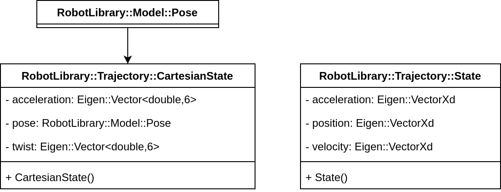

# :stopwatch: Trajectory
[:back: Back to the Foyer](../README.md)

This sub-library contains classes for generating trajectories; paths as functions of time.

:sparkles: Key Features:
- Trajectories as functions of _continuous_ time, meaning 2 robots can follow the _same_ trajectory at different frequencies.
- Smooth interpolation specifying position, velocity, _and_ acceleration for full feedback control.
- Trajectories in $\mathbb{R}^n$ (e.g. joint-space), and Cartesian space $\mathbb{SE}(3)$.
- Cubic splines, and trapezoidal velocity profiles.

### :compass: Navigation:

- [Data Structures](#data-structures)
- [Trajectory Base](#trajectory-base)
- [Spline Trajectory](#spline-trajectory)
- [Cartesian Spline](#cartesian-spline)
- [Trapezoidal Velocity](#trapezoidal-velocity)

## Data Structures

  

[:top: Back to Top](#stopwatch-trajectory)

## Trajectory Base

The purpose of this class is to provide a standardised structure to all trajectory classes. It also allows for polymorphism.

### Construction:

1. A `RobotLibrary::Trajectory::State` for the start point,
2. A `RobotLibrary::Trajectory::State` for the end point,
3. A start time, and
4. An end time.

### Key Methods:

- `query_state` returns the `RobotLibrary::Trajectory::State` for the given input time.
- `query_position` gives the desired position for the given time.

### Class Diagram:

  

[:top: Back to Top](#stopwatch-trajectory)

## Spline Trajectory:

This class builds on the `RobotLibrary::Math::Spline` object to create a spline as a function of time, over multiple dimensions. This is useful for generating joint trajectories, for example.

  

### Construction:

1. An vector of `RobotLibrary::Trajectory::State` structs specifying the waypoints,
2. An vector of times to pass through each waypoint, and
3. The polynomial order.

> [!NOTE]
> The polynomial order _must_ be odd, and the spline currently works best for $n = 3$.

> [!TIP]
> Using the robot's current joint position and velocity for the starting state of the trajectory will mean the robot will transition smoothly in to the trajectory tracking :ok_hand:

### Key Methods:

There is only 1 method: `query_state` returns the position, velocity, and acceleration for the given input time as a `RobotLibrary::Trajectory::State` struct. 

### Class Diagram:

  

[:top: Back to Top](#stopwatch-trajectory)

## Cartesian Spline

This generates splines over $\mathbb{SE}(3)$; i.e. position and orientation.

### Construction:

- A vector of `RobotLibrary::Model::Pose` poses to pass through,
- A vector of times at which to pass through them,
- An (optional) start twist (linear & angular velocity).

> [!NOTE]
> Since this class is intended to control robot arms, the final velocity is always assume to be zero (for safety reasons).

> [!TIP]
> By using the actual end-effector twist as the start, it will generate a smooth motion for the robot :ok_hand:

### Key Methods:

The `query_state` method gives a `RobotLibrary::Trajectory::CartesianState` for the given input time.

### Class Diagram:

  

[:top: Back to Top](#stopwatch-trajectory)

## Trapezoidal Velocity:

This class generates a trajectory where the velocity follows a trapezoid; ramping up at a constant acceleration, coasting at a constant velocity, then ramping down to a constant decelaration. It can also handle multiple waypoints.

  

> [!NOTE]
> Each waypoint starts and ends with zero velocity, due to the complexity of computation. For smooth transitions, it's better to use a spline.

### Construction:

1. A vector of `Eigen::VectorXd` objects specifying all the waypoints,
2. The maximum velocity,
3. The maximum acceleration, and
4. The start time (which can be used to delay initiation).

> [!NOTE]
> There is actually a `TrapezoidalBase` inside the `TrapezoidalVelocity.h` file. It's details aren't important; it's used to string together multiple waypoints.

### Key Methods:

Just one: the `query_state` method returns an `RobotLibrary::Trajectory::State` object for the given time.

### Class Diagram:

  

[:top: Back to Top](#stopwatch-trajectory)

